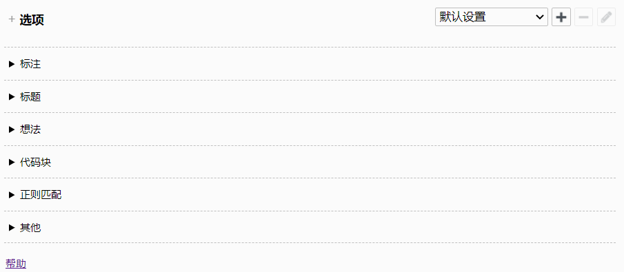
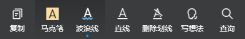

<h2 align="center"> Wereader</h2>

<strong>一个 Chrome / Firefox 扩展：主要用于微信读书做笔记，对常使用 Markdown 做笔记的读者尤其有帮助。</strong>

## 💾 安装

 

不能访问 Chrome 网上应用店时按如下操作在 Chrome 上手动安装（建议在 Chrome 网上应用店安装，因为手动安装的扩展不会自动更新）：

1. 首先，在上面给出的 GitHub 地址上依次点击 `Clone`——`Download ZIP` 下载压缩包。下载好后解压。

2. 接下来，进入 Chrome，在地址栏输入 `chrome://extensions/` 后回车，进入扩展管理页面。

3. 进入页面后，先打开 `开发者模式`，再点击 `加载已解压的扩展程序`，找到前面解压得到的文件夹 `wereader`，双击进入该文件夹，进入后**单击**里面的 `wereader-chrome` 文件夹，这时候文件夹被选中，点击 `选择文件夹` 即可。

## 🚚 功能

- 导出书评（纯文本 / HTML）

- 导出标注（本章/全书）

- 导出目录

- 导出热门标注

- 导出个人想法

- 开启图片/注释/代码块复制按钮

- 护眼色主题

- 书架分类展示

## ⚙️ 设置

在设置页面，你可以自定义导出效果。

右击扩展后点击 `选项` 即可进入扩展设置页面：

在微信读书中，标注分三类，分别是波浪线、马克笔和直线：

用直线标注的文本就是设置页面中所谓 `一级标注`，用马克笔标注的内容是 `二级标注`，用波浪线标注的内容即 `三级标注`，你可以在输入框中设置标注前后缀。

比如，如果你希望书本中用马克笔标注的文字（二级标注）导出来后加粗，你只需要将二级标注前后缀设置为 `**`。

又比如，如果你希望书本中用直线标注的文字（一级标注）导出来后加下划线，你只需要将一级标注前后缀分别设置为 `<u>` 和 `</u>`。

你也可以在设置页中设置导出标题级别。

默认级别分别是 `## `、`### ` 和 `#### ` 你可以通过改变井号数量来改变标题导出效果。

类似地，你可以设置想法前后缀，当你将前后缀设置为 `**` 时，导出的想法将会被加粗。

更多细节可在扩展设置页中查看。

## 👋 贡献

如果你有兴趣为此项目贡献代码，那么你可以：

- 完善帮助页——帮助页的 HTML 文档位于 `\wereader-chrome\options\help.html`，CSS 文件位于 `\wereader-chrome\options\help.css`。
- 完善设置页——设置页的 HTML 文档位于 `\wereader-chrome\options\options.html`，CSS 文件位于 `\wereader-chrome\options\options.css`。
- 完善阅读页滚动条——相关 CSS 文件位于 `\wereader-chrome\showScroll.css`。
- 做任何你认为有助于完善此项目的事。

不用在意贡献的大小，任何有帮助的内容都可能被接受。

如果你尝试阅读源码，有不懂的地方也可以直接联系我。

## ❤️ 致谢

| Item                                                        | Reason           |
| ------------------------------------------------------------ | ----------------- |
| [wereader](https://github.com/arry-lee/wereader)             | 此项目为该扩展的起源，我先是在 [pythontools/wereader](https://github.com/liuhao326/pythontools/tree/master/wereader) 中完善了该项目，然后才基于 pythontools/wereader 实现了该扩展 |
| [examples-of-web-crawlers](https://github.com/shengqiangzhang/examples-of-web-crawlers) | 编写 pythontools/wereader 的过程中参考了该项目中的[一键导出微信读书的书籍和笔记](https://github.com/shengqiangzhang/examples-of-web-crawlers/tree/master/12.%E4%B8%80%E9%94%AE%E5%AF%BC%E5%87%BA%E5%BE%AE%E4%BF%A1%E8%AF%BB%E4%B9%A6%E7%9A%84%E4%B9%A6%E7%B1%8D%E5%92%8C%E7%AC%94%E8%AE%B0) |
| [clipboard.js](https://github.com/zenorocha/clipboard.js)    | 扩展借助该项目实现复制文本   |
| [sweetalert2](https://github.com/sweetalert2/sweetalert2)    | 扩展借助该项目实现弹窗      |
| [HbnLg](https://www.iconfont.cn/user/detail?spm=a313x.7781069.1998910419.dcc7d6115&userViewType=collections&uid=4451423) | 图标来源于 [iconfont](https://www.iconfont.cn/collections/index?spm=a313x.7781069.1998910419.3)，图库显示 Hbnlg 为图标作者 |
| [SingleFile](https://github.com/gildas-lormeau/SingleFile) | 设置页模仿自该扩展 |

## 📚 参考

| Item                                                         | Description         |
| ------------------------------------------------------------ | ------------------- |
| [chrome-plugin-demo](https://github.com/sxei/chrome-plugin-demo) | Chrome 扩展开发教程 |
| [Extensions - Chrome Developers](https://developer.chrome.com/docs/extensions/) | Chrome 扩展官方文档 |

